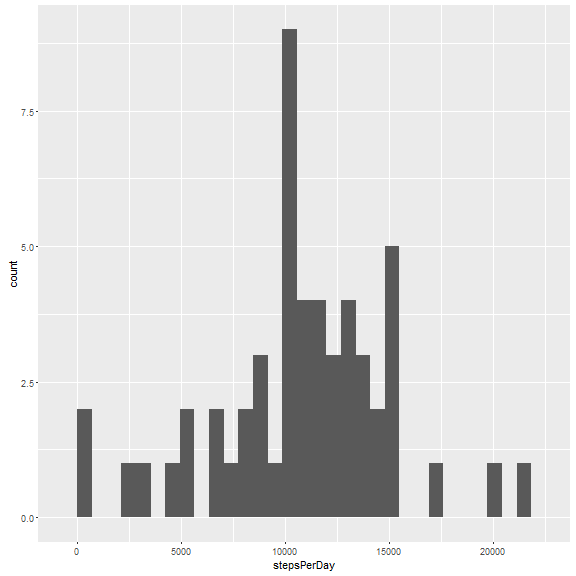

```
echo = TRUE
library(ggplot2)
```

# Reproducible Research: Peer Assessment 1


## Loading and preprocessing the data
```
setwd(".")
data <- read.csv(unzip("activity.zip","activity.csv"))
dataNoNA <- data[!is.na(data$steps), ]
```

## What is mean total number of steps taken per day?

### Total steps taken per day
```
stepsPerDay <- aggregate(dataNoNA$steps, by=list(dataNoNA$date), FUN=sum)[2]
```

### Histogram of total steps per day


```r
qplot(stepsPerDay, geom="histogram")
```

```
## Don't know how to automatically pick scale for object of type data.frame. Defaulting to continuous
```

```
## `stat_bin()` using `bins = 30`. Pick better value with `binwidth`.
```



### Compute the mean of total steps per day

```
meanTotalStepsPerDay <- mean(stepsPerDay$x)
```

The mean of the total steps per day is 1.0766189 &times; 10<sup>4</sup>.

### Compute the median of total steps per day
```
medianTotalStepsPerDay <- median(stepsPerDay$x)
```

The median of the total steps per day is 10765.

## What is the average daily activity pattern?

```
meanPerInterval <- aggregate(dataNoNA$steps, by=list(dataNoNA$interval), FUN=mean)
names(meanPerInterval) <- c("interval","steps")
```


```r
plot.ts(meanPerInterval[2])
```


## Which 5 minute interval contains the most number of steps?

```r
maxR <- meanPerInterval[which.max(meanPerInterval$steps), ]
```

The interval with the most steps on average is interval 835.

## Imputing missing values

### Calculate and report the number of missing values
```
numMissing <- length(data[is.na(data)])
```

There are 2304 NA values.

### Devise a strategy for filling in missing data
  
  Our strategy will use the average for the 5 minute interval as calculated before

#### start by copying data with NA values
```
dataImputed <- data
```

#### replace each NA value with the mean for that interval
```
dataImputed$steps[is.na(data$steps)] <- merge(data, meanPerInterval, by="interval")[is.na(data$steps), 4]
```

### Make a histogram of imputed data and report mean and median
```
totalStepsImputed <- aggregate(dataImputed$steps, by=list(dataImputed$date), FUN=sum)
names(totalStepsImputed) <- c("date", "steps")
meanImputed <- mean(totalStepsImputed$steps)
medianImputed <- median(totalStepsImputed$steps)
```


```r
qplot(totalStepsImputed$steps, geom="histogram")
```

```
## `stat_bin()` using `bins = 30`. Pick better value with `binwidth`.
```


Mean: 1.0889799 &times; 10<sup>4</sup>

Median: 1.1015 &times; 10<sup>4</sup>

## Are there differences in activity patterns between weekdays and weekends?

### Add a factor column
```
dataImputed$weekend <- ifelse(weekdays(as.Date(dataImputed$date), abbrev=TRUE) == "Sat" | weekdays(as.Date(dataImputed$date), abbrev=TRUE) == "Sun", "weekend", "weekday")

dataWeekend <- dataImputed[dataImputed$weekend=="weekend", ]
dataWeekday <- dataImputed[dataImputed$weekend=="weekday", ]

weekendAvg <- aggregate(dataWeekend$steps, by=list(dataWeekend$interval), FUN=mean)
weekdayAvg <- aggregate(dataWeekday$steps, by=list(dataWeekday$interval), FUN=mean)
```

### Plot of weekend vs weekday patterns

```r
par(mfrow=c(2,1))
plot.ts(weekendAvg[2], main="Weekend")
plot.ts(weekdayAvg[2], main="Weekday")
```


